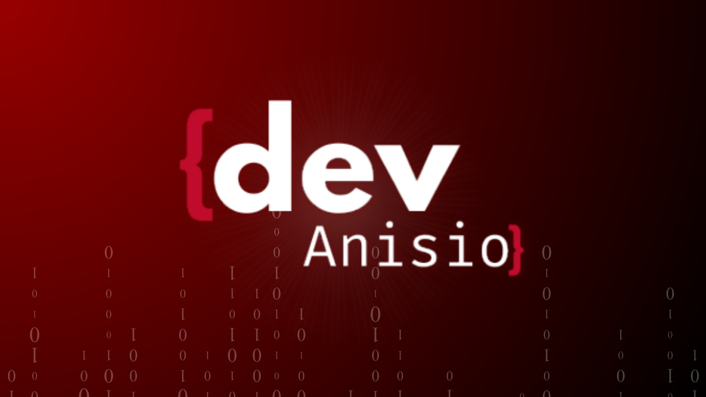

  <!-- Substitua o link abaixo pela URL do seu banner hospedado no próprio GitHub -->
  

    

  <h3>Front-end Developer • Computer Science Student • Building Real Projects</h3>

  

    Sou estudante de Ciência da Computação e desenvolvedor Front-end em formação. Meu foco atual é construir interfaces modernas, performáticas e intuitivas, com o objetivo de atuar como Front-end Developer Júnior e, futuramente, evoluir para Full Stack.
  

## 💻 Tech Stack

  <!-- Front-end -->
  
  
  
  
  
  
   
  <!-- Back-end & DB -->
  
  
  
  
   
  <!-- Tools -->
  
  

## 🚀 Projetos em Destaque

<table align="center">
  <tr>
    <td align="center" width="50%">
      <!-- Substitua o link pela imagem de capa do projeto -->
      
       
      <h3>Meu App Vida</h3>
      
Aplicação web para organização pessoal, rotina, estudos e finanças com integração de IA.

      <i>React • Vite • Tailwind CSS • Firebase</i>
        
      <a href="https://github.com/AnisioDiogo/Conflui-web/tree/main">🔗 Acessar Repositório</a>
    </td>
    <td align="center" width="50%">
      
       
      <h3>Pizzaria Oliveira</h3>
      
Sistema web de pedidos com carrinho, painel administrativo e gerenciamento.

      <i>React • Firebase</i>
        
      <a href="https://github.com/AnisioDiogo/pizzaria-oliveira">🔗 Acessar Repositório</a>
    </td>
  </tr>
  <tr>
    <td align="center" width="50%">
      
       
      <h3>Bee Life</h3>
      
Aplicação full-stack combinando ecossistema de front e back-end estruturado.

      <i>React • Python • FastAPI</i>
        
      <a href="https://github.com/SEU_USUARIO/bee-life">🔗 Acessar Repositório</a>
    </td>
    <td align="center" width="50%">
      
       
      <h3>Blog B. Silva</h3>
      
Projeto web completo com prototipagem de interface e desenvolvimento focado em UI.

      <i>HTML • CSS • Figma</i>
        
      <a href="https://github.com/AnisioDiogo/blog-b-silva">🔗 Acessar Repositório</a>
    </td>
  </tr>
  <tr>
    <td align="center" colspan="2">
      
       
      <h3>Receitas do Nordeste</h3>
      
Projeto acadêmico focado em estruturação semântica e estilização.

      <i>HTML5 • CSS3</i>
        
      <a href="https://github.com/AnisioDiogo/receitas-do-nordeste">🔗 Acessar Repositório</a>
    </td>
  </tr>
</table>

## 📊 Estatísticas

  
  

